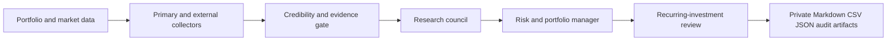

# Architecture

## Typed Decision Path



Collectors return `ExternalItem` records and source-health statuses. The
credibility layer scores the source, claim, manager fragility, manipulation
risk and research weight. Evidence aggregation deduplicates accounts by
`independence_group`.

The research council emits a candidate action. The portfolio manager applies
volatility, correlation, market regime, position caps, group caps, turnover,
cash and buying-power limits. The recurring-investment engine consumes the
verified research result and can only produce a manual next-cycle review.

## Decision Precedence

1. Explicit failed thesis check -> EXIT candidate.
2. Price/volume anomaly or evidence thesis risk -> REVIEW.
3. Existing non-tracking overweight position -> risk rebalance.
4. Mature single-stock thesis plus configured gain threshold -> TRIM candidate.
5. Drawdown plus complete evidence gate and capacity -> ADD candidate.
6. Otherwise -> continue holding.

Tracking positions skip mechanical overweight and short-term P/L rebalancing.

## Evidence Precedence

Primary SEC/company evidence has the highest source cap. Financial publishers,
fund managers, independent KOLs and anonymous social content receive lower
caps. A credible manager can inform research while still failing the copy-trade
gate because of leverage, concentration, liquidity or funding fragility.

```text
ADD/OPEN allowed
= primary source present
and independent groups >= 2
and coverage >= threshold
and manipulation risk < threshold
and aggregate support sufficient
and portfolio/risk-group capacity available
```

## Source Failure Semantics

- `ok`: request and parsing succeeded;
- `partial`: at least one target succeeded and another failed;
- `blocked`: required credential or permission is missing;
- `disabled`: explicitly disabled or offline smoke mode;
- `error`: the request/parser failed.

`blocked` and `error` must not be rephrased as “no relevant data”.

## Execution Boundary

The system writes proposed USD/share changes for audit but has no broker client,
broker credential or order endpoint. All changes require manual confirmation.
Private portfolio inputs, state and report outputs must stay in ignored local or
private-runtime paths; public CI uses synthetic inputs only.
